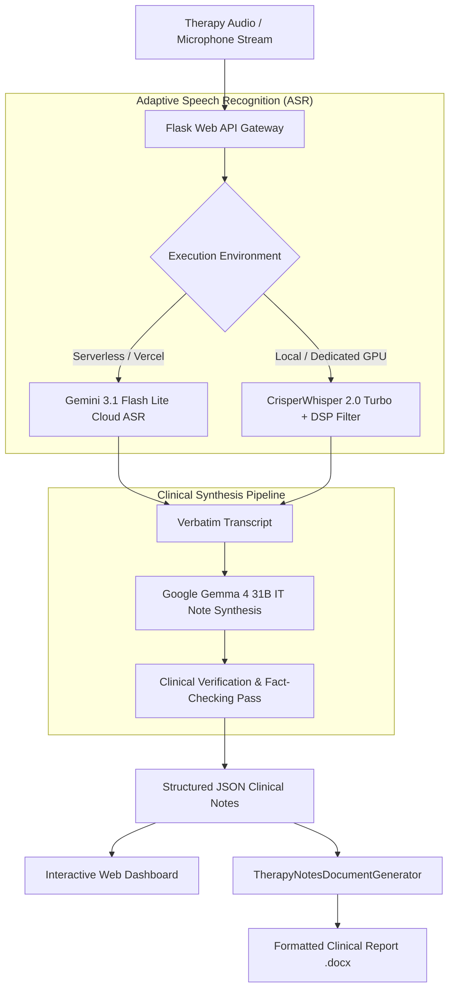

# AI Therapy Notes Maker

[](https://python.org)
[](https://flask.palletsprojects.com/)
[](https://ai.google.dev/)
[](https://ai.google.dev/)
[](https://vercel.com)
[](LICENSE)

An AI-powered clinical documentation system designed to transcribe therapy sessions (both recorded audio files and real-time microphone dictation) and synthesize structured, evidence-based therapy notes, diagnostic reflections, and downloadable Microsoft Word (`.docx`) clinical reports.

---

## Architecture & Workflow



---

## Features

- **Dual-Mode Speech Recognition**:
  - **Cloud-Native Mode (Serverless / Vercel)**: Zero-dependency audio transcription powered by Google Gemini 2.5 Flash Multimodal Audio.
  - **Local GPU Mode**: Verbatim speech recognition with **CrisperWhisper 2.0 Turbo** preserving fillers, pauses, stutters, and emotional cues.
- **Evidence-Based Note Generation**: Synthesizes comprehensive clinical structures (Session Overview, Client Concerns, Goals & Progress, Interventions, Client's Response, Challenges, Homework Plan, and Next Session Prompts).
- **Validation & Hallucination Defense**: Dual-pass verification comparing synthesized notes directly against original verbatim transcripts.
- **Formatted DOCX Export**: Automatically produces clinical Word reports with client and therapist metadata headers and bulleted clinical sections.
- **Modern Responsive Web Interface**: Real-time microphone audio visualizer, drag-and-drop file upload, live processing steps, section-by-section clipboard copy, and DOCX download.

---

## Project Structure

```
AI-Therpy-Notes-Maker/
├── api/
│   ├── __init__.py           # Package marker
│   └── index.py              # Vercel serverless WSGI bridge
├── asr/
│   ├── __init__.py           # ASR factory & exports
│   ├── crisper_whisper.py    # Local CrisperWhisper transcriber
│   ├── gemini_asr.py         # Cloud-native Gemini audio transcriber
│   └── preprocessing.py      # Audio DSP filter (high-pass, trim, noise reduction)
├── config/
│   ├── __init__.py           # Package marker
│   └── config.py             # Environment configuration & dynamic storage paths
├── summarizer/
│   ├── __init__.py           # Summarizer exports
│   ├── docgen.py             # DOCX Word report generator
│   └── summarizer.py         # Gemini clinical synthesis & validation
├── templates/
│   └── index.html            # Web UI with voice recorder & dashboard
├── .env.example              # Sample environment configuration
├── .gitignore                # Git ignore rules
├── api.py                    # REST API Blueprint routes
├── app.py                    # Main Flask application entrypoint
├── requirements.txt          # Lightweight dependencies (Vercel compatible)
├── requirements-local.txt    # Optional local GPU/PyTorch dependencies
└── vercel.json               # Vercel deployment routing configuration
```

---

## Quick Start (Local Development)

### 1. Clone & Setup Environment

```bash
git clone https://github.com/Rana-Tigrina/AI-Therpy-Notes-Maker.git
cd AI-Therpy-Notes-Maker

python -m venv venv
# Windows:
venv\Scripts\activate
# macOS/Linux:
source venv/bin/activate
```

### 2. Install Dependencies

For standard/cloud development (recommended):
```bash
pip install -r requirements.txt
```

For local PyTorch + CrisperWhisper GPU acceleration:
```bash
pip install -r requirements-local.txt
```

### 3. Configure Environment Variables

Create a `.env` file in the project root:

```env
GEMINI_API_KEY=your_google_gemini_api_key_here
NOTE_GENERATION_MODEL=gemma-4-31b-it
GEMINI_ASR_MODEL=gemini-3.1-flash-lite
FALLBACK_MODEL=gemini-2.5-flash
ASR_BACKEND=auto
LOG_LEVEL=INFO
```

### 4. Run the Server

```bash
python app.py
```

Visit `http://localhost:5000` in your web browser.

---

## Deploying to Vercel

This repository is pre-configured for seamless **Vercel Serverless** deployment.

### Step 1: Connect Repository to Vercel
1. Push your repository to GitHub / GitLab.
2. Go to [Vercel Dashboard](https://vercel.com) and click **Add New Project**.
3. Import your `AI-Therpy-Notes-Maker` repository.

### Step 2: Configure Environment Variables in Vercel
In the Vercel project settings, add:
- `GEMINI_API_KEY`: Your Google Gemini API key.
- `ASR_BACKEND`: `gemini`
- `NOTE_GENERATION_MODEL`: `gemma-4-31b-it`
- `GEMINI_ASR_MODEL`: `gemini-3.1-flash-lite`
- `FALLBACK_MODEL`: `gemini-2.5-flash`

### Step 3: Deploy
Click **Deploy**. Vercel will automatically build and deploy the Flask serverless application using `vercel.json` and `api/index.py`.

---

## Environment Variables Reference

| Variable | Type | Default | Description |
| :--- | :--- | :--- | :--- |
| `GEMINI_API_KEY` | String | *(Required)* | Google Gemini API key for transcription and note generation |
| `NOTE_GENERATION_MODEL` | String | `gemma-4-31b-it` | Primary model name for clinical notes synthesis |
| `GEMINI_ASR_MODEL` | String | `gemini-3.1-flash-lite` | Primary cloud ASR model name for audio transcription |
| `FALLBACK_MODEL` | String | `gemini-2.5-flash` | Automatic fallback model used if primary models encounter 503/high-demand/rate limits |
| `ASR_BACKEND` | String | `auto` | `auto` (detects local/cloud), `gemini` (cloud ASR), or `crisper_whisper` (local) |
| `CRISPER_WHISPER_MODEL`| String | `small` | HuggingFace model tag or size for local CrisperWhisper |
| `ENABLE_DEMO_LIMITS` | Boolean | `true` | When true, enforces max 60s audio duration and 2 custom uploads per session |
| `MAX_AUDIO_DURATION_SEC` | Integer | `60` | Maximum audio duration in seconds for public testing |
| `MAX_USER_UPLOADS` | Integer | `2` | Maximum custom audio files allowed per user session |
| `STORAGE_DIR` | String | System temp (on Vercel) / `.` (local) | Runtime storage directory for uploads & generated files |
| `LOG_LEVEL` | String | `INFO` | Logging level (`DEBUG`, `INFO`, `WARNING`, `ERROR`) |
| `MAX_CONTENT_LENGTH` | Integer | `52428800` (50MB) | Maximum allowable upload file size in bytes |

---

## API Endpoints Reference

### `POST /process_demo`
Instantly processes the built-in 27-second sample therapy consultation (`static/demo.mp3`) without consuming custom upload quota.

### `POST /process_audio_file`
Uploads an audio file (up to 60 seconds), transcribes it, and synthesizes structured clinical notes.

**Request**:
- `multipart/form-data` with key `audio` containing the audio file (`.wav`, `.mp3`, `.m4a`, `.webm`, `.ogg`, `.mp4`).

**Response** (`200 OK`):
```json
{
  "status": "success",
  "validated_therapy_notes": {
    "session_overview": { ... },
    "client_concerns": { ... },
    "goals_and_progress": { ... },
    "therapeutic_interventions": { ... },
    "clients_response": { ... },
    "challenges": { ... },
    "homework_plan": { ... },
    "next_session_prompts": { ... }
  },
  "docx_url": "/download/<unique_id>_therapy_notes.docx"
}
```

### `GET /download/<filename>`
Downloads the generated Microsoft Word (`.docx`) report.

---

## License

Distributed under the MIT License. See `LICENSE` for details.